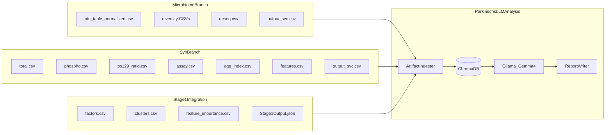

# ParkinsonsLLMAnalysis Implementation Plan

> **For agentic workers:** REQUIRED SUB-SKILL: Use superpowers:subagent-driven-development (recommended) or superpowers:executing-plans to implement this plan task-by-task. Steps use checkbox (`- [ ]`) syntax for tracking.

**Goal:** Build a standalone PluMA plugin that turns multi-omics Parkinson's pipeline outputs into per-subject RAG-augmented clinical/scientific reports (Markdown + PDF), with hardware-aware local LLM inference via Ollama.

**Architecture:** New repo at [`/home/joseph/Projects/PluMA/ParkinsonsLLMAnalysis/`](/home/joseph/Projects/PluMA/ParkinsonsLLMAnalysis/) following the standard plugin layout. Core class `ParkinsonsLLMAnalysis` orchestrates five phases: (1) hardware-aware model provisioning via Ollama, (2) artifact ingestion from upstream plugins into modality-scoped ChromaDB collections, (3) multi-pass RAG queries + LLM analysis (scientific + clinical), (4) report generation (Markdown → HTML → PDF via Micropdf), (5) lifecycle cleanup (stop Ollama if we started it, delete temp dirs). No dependency on [`LLMSummarizer/`](/home/joseph/Projects/PluMA/LLMSummarizer/) — patterns may be referenced but code is written fresh.

**Tech Stack:** Python 3.11+, Ollama (≥0.20 for Gemma 4), ChromaDB, pandas, psutil, `markdown` (MD→HTML), `micropdf` (HTML→PDF), pytest.

**Plan file location:** [`ParkinsonsLLMAnalysis/docs/superpowers/plans/2026-05-21-parkinsons-llm-analysis.md`](/home/joseph/Projects/PluMA/ParkinsonsLLMAnalysis/docs/superpowers/plans/2026-05-21-parkinsons-llm-analysis.md)

---

## Relationship to existing work

[`LLMSummarizer`](/home/joseph/Projects/PluMA/LLMSummarizer/) already does cohort-level Ollama summarization with **PubMed literature** ChromaDB. This plugin is **standalone** and differs in four ways:

| Requirement | LLMSummarizer today | ParkinsonsLLMAnalysis |
|---|---|---|
| RAG source | External literature DB | **Pipeline artifacts** indexed fresh each run |
| Scope | Cohort summary | **Per-subject** PD likelihood + full report |
| Output | `.txt`, `.md`, `.json` | `.md`, `.pdf`, `.json` per subject + cohort |
| Lifecycle | Starts Ollama, never stops | **Starts if needed, stops + cleans up** |

Upstream artifacts to ingest (from current + planned Parkinson's pipeline):



---

## File structure

```
ParkinsonsLLMAnalysis/
├── ParkinsonsLLMAnalysis.py          # Core plugin class (input/run/output)
├── ParkinsonsLLMAnalysisPlugin.py    # PluMA loader wrapper
├── hardware.py                       # CPU/RAM/GPU detection
├── model_catalog.py                  # HF provenance + Ollama tag mapping
├── ollama_lifecycle.py               # start/stop/pull/generate + ownership tracking
├── artifact_ingest.py                  # CSV/JSON/TXT/TSV → Document records
├── chroma_store.py                   # Build/query modality collections
├── prompts.py                        # Clinical + scientific prompt templates
├── analysis.py                       # RAG + LLM orchestration per subject
├── report_writer.py                  # Markdown assembly
├── pdf_writer.py                     # MD → HTML → PDF via micropdf
├── cleanup.py                        # Temp dir + Ollama shutdown
├── parameters.parkinsonsllmanalysis.txt
├── requirements.txt
├── requirements-test.txt
├── pytest.ini
├── AGENTS.md
├── README.md
├── LICENSE
├── example/
│   ├── config.txt
│   ├── parameters.txt
│   └── synthetic/                    # Minimal upstream fixture set
├── tests/
│   ├── test_hardware.py
│   ├── test_model_catalog.py
│   ├── test_artifact_ingest.py
│   ├── test_chroma_store.py
│   ├── test_analysis.py
│   ├── test_report_writer.py
│   ├── test_pdf_writer.py
│   ├── test_cleanup.py
│   └── test_parkinsons_llm_analysis.py
└── docs/superpowers/plans/2026-05-21-parkinsons-llm-analysis.md
```

Symlink into PluMA: `PluMA/plugins/ParkinsonsLLMAnalysis → ../../ParkinsonsLLMAnalysis`

---

## Model selection strategy (req 1–3)

**Hugging Face + Ollama:** Gemma 4 weights on HF (`google/gemma-4-31B`, `google/gemma-4-26B-A4B`, etc.) are served locally via **Ollama tags** (requires Ollama ≥0.20). The plugin records HF repo IDs in `model_catalog.py` for provenance but downloads via `ollama pull` to avoid duplicate weight storage.

**Tier table** (select highest tier hardware can run):

| Tier | Ollama tag | HF reference | Min VRAM/RAM | Use when |
|---|---|---|---|---|
| 1 | `gemma4:31b` | `google/gemma-4-31B` | 24 GB GPU | High-end GPU |
| 2 | `gemma4:26b` | `google/gemma-4-26B-A4B` | 16 GB GPU | Mid-high GPU (MoE, 4B active) |
| 3 | `gemma4:e4b` | Gemma 4 E4B IT | 10 GB | Default GPU / strong CPU |
| 4 | `gemma4:e2b` | Gemma 4 E2B IT | 8 GB | Low VRAM fallback |
| 5 | `llama3.1:8b` | Meta Llama 3.1 8B | 8 GB | Gemma 4 unavailable |

`select_model(hardware)` walks tiers top-down; `ensure_model(tag)` checks `ollama list`, pulls if missing.

**GPU inference:** Ollama auto-uses GPU when available. Set `OLLAMA_NUM_GPU=999` (or tier-appropriate layer count) via env before `ollama serve` when GPU detected. No direct HF `transformers` inference in v1.

---

## ChromaDB design (req 4–5)

**One persistent session DB** under `{work_dir}/chroma/` rebuilt each run (deleted in cleanup unless `keep_chroma true`).

**Collections** (metadata field `work_type` on every document):

| Collection | work_type | Source artifacts |
|---|---|---|
| `microbiome` | microbiome | `otu_table*.csv`, `deseq.csv`, diversity CSVs, `*.summary.txt` |
| `proteomics` | proteomics | `Syn/total.csv`, `phospho.csv`, `ps129_ratio.*`, `agg_index.*`, `features.csv` |
| `clinical_assay` | clinical_assay | `assay.csv`, QC columns |
| `clinical_labels` | clinical | `sample_data.csv`, `Samples.Syn.txt`, `traininggroups.csv` |
| `integration_mofa` | integration_mofa | `*.factors.csv`, `*.weights_*.csv`, `*.variance_explained.csv` |
| `integration_snf` | integration_snf | `*.clusters.csv`, `*.fused_similarity.csv` |
| `integration_fusion` | integration_fusion | `*.fused_matrix.csv`, `*.selected_features.csv`, `*.cv_results.csv` |
| `explainability` | explainability | `*.feature_importance.csv`, `*.modality_importance.csv`, `*.summary.txt` |
| `ml_predictions` | ml_predictions | `output_svc.csv`, per-subject classifier outputs |
| `stage1_outputs` | stage1 | `Stage1Output` JSON files |

**Document format:** Each ingested chunk is a JSON-serialized record:

```python
{
  "doc_id": "proteomics:PD_001:ps129_ratio",
  "subject_id": "PD_001",          # or "COHORT" for aggregate rows
  "work_type": "proteomics",
  "source_file": "Syn/ps129_ratio.csv",
  "summary_text": "Sample PD_001 ps129_ratio=0.42 ...",
  "raw_payload": "{...}"           # compact JSON of row/feature
}
```

Embedding: ChromaDB default embedding function (no extra model download in v1). Upgrade path: `sentence-transformers/all-MiniLM-L6-v2` behind a param flag.

**RAG query flow per analysis pass:**
1. Build query from subject ID + section intent (e.g. `"PD_001 proteomics alpha-synuclein biomarkers"`)
2. Query relevant collections filtered by `subject_id` OR `COHORT`
3. Top-k chunks → prompt context block
4. Two LLM passes per subject: **scientific_analysis** (methods, biomarkers, cross-modal patterns) and **clinical_analysis** (interpretation, limitations, actionable insights)

---

## Parameter file (req 4–6)

[`parameters.parkinsonsllmanalysis.txt`](/home/joseph/Projects/PluMA/ParkinsonsLLMAnalysis/parameters.parkinsonsllmanalysis.txt) — whitespace key-value, `#` comments:

```
# Required
subjects_file Syn/Samples.Syn.txt
work_dir /tmp/parkinsons_llm_run

# Upstream artifacts (paths optional; missing = skip collection)
microbiome_otu CSV/otu_table_normalized.csv
microbiome_deseq CSV/deseq.csv
syn_features Syn/features.csv
syn_assay Syn/assay.csv
syn_labels Syn/traininggroups.csv
shap_importance out/shap.feature_importance.csv
mofa_factors out/factors.csv
snf_clusters out/clusters.csv
stage1_json_dir data/integrated/
svc_microbiome CSV/output_svc.csv
svc_syn Syn/output_svc.csv

# LLM
model_name auto
temperature 0.2
max_tokens 2048
ollama_auto_start true
ollama_auto_stop true

# Output
output_pdf true
keep_chroma false
keep_temp_html false
```

Glob alternative: `artifact_manifest path/to/manifest.yaml` listing all files (preferred for full pipeline wiring).

---

## Report outputs (req 6–7)

Per subject `{output_base}_{subject_id}`:

| Suffix | Content |
|---|---|
| `.md` | Full report with fixed sections (see below) |
| `.pdf` | Micropdf HTML render |
| `.json` | Structured findings + RAG citations + PD likelihood |

Cohort rollup: `{output_base}_cohort.md` / `.pdf` / `.json`

**Markdown section template:**

1. Title + metadata (model, hardware, timestamp)
2. Subject profile (ID, label, available modalities)
3. **Parkinson's Likelihood Assessment** (per-subject; LLM + structured score from SVC/Stage1Output/α-syn features)
4. Microbiome findings (RAG-backed)
5. Proteomics / α-syn findings
6. Integration results (MOFA/SNF/fusion)
7. Explainability (SHAP highlights)
8. Scientific analysis (cross-modal synthesis)
9. Clinical analysis (plain-language interpretation, caveats)
10. Data limitations + methods note

**PD likelihood block** (structured JSON + prose):

```python
@dataclass
class PDLikelihood:
    subject_id: str
    label: Literal["likely_PD", "unlikely_PD", "indeterminate"]
    confidence: float          # 0.0–1.0
    supporting_evidence: list[str]
    contradicting_evidence: list[str]
    model_basis: str           # e.g. "SVC + α-syn features + SHAP + LLM synthesis"
```

Deterministic pre-score from available numeric inputs (SVC prediction, α-syn ratios, Stage1Output confidence) feeds the LLM; LLM produces final label + narrative with RAG context.

**PDF path:** `markdown` library → styled HTML template → `micropdf.html_to_pdf()`. Add `micropdf` as optional dep in `requirements.txt` with graceful skip + warning if native lib missing.

---

## Lifecycle + cleanup (req 8–9)

Track in `OllamaSession`:

```python
@dataclass
class OllamaSession:
    started_by_plugin: bool
    server_pid: int | None
    work_dir: Path
    temp_paths: list[Path]
```

**Cleanup order** (always in `finally` block of `run()`):
1. Delete `{work_dir}/chroma/` unless `keep_chroma true`
2. Delete temp HTML files unless `keep_temp_html true`
3. If `started_by_plugin` and `ollama_auto_stop true`: SIGTERM the `ollama serve` PID we spawned (do **not** kill user-pre-existing Ollama)
4. Remove empty `{work_dir}` if we created it

---

## Pipeline integration

Append to [`Parkinsons/config.txt`](/home/joseph/Projects/PluMA/Parkinsons/config.txt) after both SVC branches merge (new `EndParallel` block or sequential tail):

```
Plugin ParkinsonsLLMAnalysis inputfile parameters.parkinsonsllmanalysis.txt outputfile reports/parkinsons_analysis
```

Requires a post-merge step that collects paths from both parallel branches into the parameter file (or manifest YAML generated by a small `CSVMerge`-style prep script in `example/`).

---

## Implementation tasks

### Task 1: Repo scaffolding

**Files:**
- Create: all top-level files listed in file structure
- Create: [`ParkinsonsLLMAnalysisPlugin.py`](/home/joseph/Projects/PluMA/ParkinsonsLLMAnalysis/ParkinsonsLLMAnalysisPlugin.py) (thin wrapper like [`SHAPExplainabilityPlugin.py`](/home/joseph/Projects/PluMA/SHAPExplainability/SHAPExplainabilityPlugin.py))

- [ ] **Step 1: Write failing plugin contract test**

```python
# tests/test_parkinsons_llm_analysis.py
from pathlib import Path
import sys
sys.path.insert(0, str(Path(__file__).parent.parent))
from ParkinsonsLLMAnalysis import ParkinsonsLLMAnalysis

def test_plugin_has_pluma_lifecycle():
    p = ParkinsonsLLMAnalysis()
    assert callable(getattr(p, "input", None))
    assert callable(getattr(p, "run", None))
    assert callable(getattr(p, "output", None))
```

- [ ] **Step 2: Run test — expect FAIL**

Run: `cd ParkinsonsLLMAnalysis && pytest tests/test_parkinsons_llm_analysis.py::test_plugin_has_pluma_lifecycle -v`

- [ ] **Step 3: Implement minimal stub class**

```python
# ParkinsonsLLMAnalysis.py
class ParkinsonsLLMAnalysis:
    def __init__(self) -> None:
        self.parameters: dict[str, str] = {}
    def input(self, filename: str) -> None:
        self.parameters = _parse_params(filename)
    def run(self) -> None:
        pass
    def output(self, filename: str) -> None:
        pass
```

- [ ] **Step 4: Run test — expect PASS**
- [ ] **Step 5: Commit** scaffolding + pytest.ini + requirements

---

### Task 2: Hardware detection

**Files:** Create [`hardware.py`](/home/joseph/Projects/PluMA/ParkinsonsLLMAnalysis/hardware.py), [`tests/test_hardware.py`](/home/joseph/Projects/PluMA/ParkinsonsLLMAnalysis/tests/test_hardware.py)

- [ ] **Step 1: Write failing tests** for `detect_hardware()` returning `HardwareInfo(cpu_cores, ram_gb, gpu_available, gpu_name, gpu_vram_gb)` and `has_gpu()` helper
- [ ] **Step 2: Run tests — FAIL**
- [ ] **Step 3: Implement** using `os.cpu_count()`, `/proc/meminfo` or `psutil`, `nvidia-smi`/`rocm-smi` subprocess probes (mock subprocess in tests)
- [ ] **Step 4: Run tests — PASS**
- [ ] **Step 5: Commit**

---

### Task 3: Model catalog + Ollama lifecycle

**Files:** Create [`model_catalog.py`](/home/joseph/Projects/PluMA/ParkinsonsLLMAnalysis/model_catalog.py), [`ollama_lifecycle.py`](/home/joseph/Projects/PluMA/ParkinsonsLLMAnalysis/ollama_lifecycle.py), tests

- [ ] **Step 1: Write failing tests**
  - `select_model(HardwareInfo(gpu_vram_gb=24))` → `gemma4:31b`
  - `select_model(HardwareInfo(gpu_vram_gb=6, ram_gb=16))` → `gemma4:e2b`
  - `ensure_model("gemma4:e4b")` calls mocked `ollama.pull` when not in `ollama.list`
  - `stop_ollama_if_started(session)` only kills PID when `started_by_plugin=True`

- [ ] **Step 2: Run tests — FAIL**
- [ ] **Step 3: Implement** `OllamaSession`, `ensure_ollama_running()`, `generate(prompt)`, `download_model()`, `stop_ollama_if_started()`
- [ ] **Step 4: Run tests — PASS**
- [ ] **Step 5: Commit**

---

### Task 4: Artifact ingestion

**Files:** Create [`artifact_ingest.py`](/home/joseph/Projects/PluMA/ParkinsonsLLMAnalysis/artifact_ingest.py), [`example/synthetic/`](/home/joseph/Projects/PluMA/ParkinsonsLLMAnalysis/example/synthetic/) fixtures, tests

- [ ] **Step 1: Write failing tests** ingesting:
  - Syn `features.csv` → documents with `work_type=proteomics`, correct `subject_id`
  - `Stage1Output`-style JSON → `work_type=stage1`
  - Missing file → skip silently with logged warning

- [ ] **Step 2: Run tests — FAIL**
- [ ] **Step 3: Implement** `load_subjects(subjects_file) -> list[str]`, `ingest_csv(path, work_type, subject_col)`, `ingest_json_dir(path)`, `ingest_all(params) -> list[DocumentRecord]`
- [ ] **Step 4: Run tests — PASS**
- [ ] **Step 5: Commit** (force-add synthetic CSVs: `git add -f example/synthetic/`)

---

### Task 5: ChromaDB store

**Files:** Create [`chroma_store.py`](/home/joseph/Projects/PluMA/ParkinsonsLLMAnalysis/chroma_store.py), tests

- [ ] **Step 1: Write failing tests**
  - `build_store(docs, db_path)` creates collections per `work_type`
  - `query_subject(db, subject_id, work_types, query_text, k=5)` returns ranked chunks

- [ ] **Step 2: Run tests — FAIL**
- [ ] **Step 3: Implement** using `chromadb.PersistentClient`; upsert with metadata filters
- [ ] **Step 4: Run tests — PASS**
- [ ] **Step 5: Commit**

---

### Task 6: Prompts + analysis orchestration

**Files:** Create [`prompts.py`](/home/joseph/Projects/PluMA/ParkinsonsLLMAnalysis/prompts.py), [`analysis.py`](/home/joseph/Projects/PluMA/ParkinsonsLLMAnalysis/analysis.py), tests

- [ ] **Step 1: Write failing tests**
  - `build_pd_likelihood_prompt(subject, rag_context, structured_signals)` contains subject ID + evidence
  - `analyze_subject(...)` returns dict with keys `scientific_analysis`, `clinical_analysis`, `pd_likelihood`
  - Mock Ollama returns fixed JSON → parser extracts `PDLikelihood`

- [ ] **Step 2: Run tests — FAIL**
- [ ] **Step 3: Implement** two-pass RAG query (scientific collections first, then clinical), structured pre-scoring from SVC + α-syn columns
- [ ] **Step 4: Run tests — PASS**
- [ ] **Step 5: Commit**

---

### Task 7: Report writer (Markdown)

**Files:** Create [`report_writer.py`](/home/joseph/Projects/PluMA/ParkinsonsLLMAnalysis/report_writer.py), tests

- [ ] **Step 1: Write failing test** — `render_subject_report(...)` output contains `# Parkinson's Likelihood Assessment` and modality sections
- [ ] **Step 2: Run test — FAIL**
- [ ] **Step 3: Implement** section renderers + cohort rollup
- [ ] **Step 4: Run test — PASS**
- [ ] **Step 5: Commit**

---

### Task 8: PDF writer (Micropdf)

**Files:** Create [`pdf_writer.py`](/home/joseph/Projects/PluMA/ParkinsonsLLMAnalysis/pdf_writer.py), tests

- [ ] **Step 1: Write failing test** — mock `micropdf.html_to_pdf`, assert called with HTML containing report title
- [ ] **Step 2: Run test — FAIL**
- [ ] **Step 3: Implement** `markdown_to_html(md) -> str` using `markdown` lib + CSS template; `write_pdf(md_path, pdf_path)` via micropdf
- [ ] **Step 4: Run test — PASS**
- [ ] **Step 5: Commit**

Add to `requirements.txt`: `markdown>=3.5`, `micropdf` (path dep or PyPI when published).

---

### Task 9: Cleanup manager

**Files:** Create [`cleanup.py`](/home/joseph/Projects/PluMA/ParkinsonsLLMAnalysis/cleanup.py), tests

- [ ] **Step 1: Write failing tests** for temp dir removal, conditional chroma keep, Ollama stop guard
- [ ] **Step 2: Run tests — FAIL**
- [ ] **Step 3: Implement** `cleanup_session(session, params)`
- [ ] **Step 4: Run tests — PASS**
- [ ] **Step 5: Commit**

---

### Task 10: Wire `run()` + `output()` + integration test

**Files:** Modify [`ParkinsonsLLMAnalysis.py`](/home/joseph/Projects/PluMA/ParkinsonsLLMAnalysis/ParkinsonsLLMAnalysis.py)

- [ ] **Step 1: Write failing end-to-end test** with mocked Ollama + real ChromaDB on tmp_path using `example/synthetic/` fixtures; assert `.md`, `.json` written
- [ ] **Step 2: Run test — FAIL**
- [ ] **Step 3: Implement full `run()` pipeline:**

```python
def run(self) -> None:
    session = OllamaSession(work_dir=Path(self.parameters["work_dir"]))
    try:
        hw = detect_hardware()
        model = self.parameters.get("model_name", "auto")
        if model == "auto":
            model = select_model(hw)
        session = ensure_ollama_running(session, self.parameters)
        ensure_model(model)
        subjects = load_subjects(self.parameters["subjects_file"])
        docs = ingest_all(self.parameters)
        db_path = session.work_dir / "chroma"
        build_store(docs, db_path)
        for subject_id in subjects:
            result = analyze_subject(subject_id, db_path, model, self.parameters)
            self._results[subject_id] = result
    finally:
        cleanup_session(session, self.parameters)
```

- [ ] **Step 4: Implement `output()`** writing `.md`, `.pdf`, `.json` per subject via `Path(filename).with_suffix(...)`
- [ ] **Step 5: Run full test suite** — `pytest -v` (integration test marked `@pytest.mark.integration`, skipped in CI without Ollama)
- [ ] **Step 6: Commit**

---

### Task 11: Example + Parkinsons wiring + docs

**Files:** Create [`example/config.txt`](/home/joseph/Projects/PluMA/ParkinsonsLLMAnalysis/example/config.txt), [`AGENTS.md`](/home/joseph/Projects/PluMA/ParkinsonsLLMAnalysis/AGENTS.md), [`README.md`](/home/joseph/Projects/PluMA/ParkinsonsLLMAnalysis/README.md); update [`Parkinsons/config.txt`](/home/joseph/Projects/PluMA/Parkinsons/config.txt)

- [ ] **Step 1:** Example config runnable via `./pluma plugins/ParkinsonsLLMAnalysis/example/config.txt`
- [ ] **Step 2:** Document prerequisites (Ollama ≥0.20, optional micropdf native lib)
- [ ] **Step 3:** Symlink plugin into `PluMA/plugins/`
- [ ] **Step 4: Commit**

---

## Self-review checklist

| Requirement | Task |
|---|---|
| 1. Detect hardware | Task 2 |
| 2. Download appropriate LLM (Gemma 4 tiers) | Task 3 |
| 3. Launch Ollama with GPU | Task 3 |
| 4. Ingest all pipeline content → ChromaDB | Tasks 4–5 |
| 5. RAG prompts, multi-omic by work type | Tasks 5–6 |
| 6. Markdown report + PD likelihood | Tasks 6–7 |
| 7. Markdown → PDF | Task 8 |
| 8. Stop Ollama | Tasks 3, 9 |
| 9. Cleanup artifacts | Task 9 |

**Gaps addressed:** Per-subject PD likelihood (user choice). Standalone repo (user choice). Literature RAG intentionally out of scope for v1 — can add optional `use_literature_rag` in a follow-up.

**Risk mitigations:**
- Gemma 4 requires Ollama ≥0.20 — detect version at startup, fall back to `llama3.1:8b` with warning
- Micropdf native lib may be absent — PDF step optional with clear error in report JSON
- Parallel Parkinsons branches produce outputs in different dirs — use `artifact_manifest` YAML to unify paths
